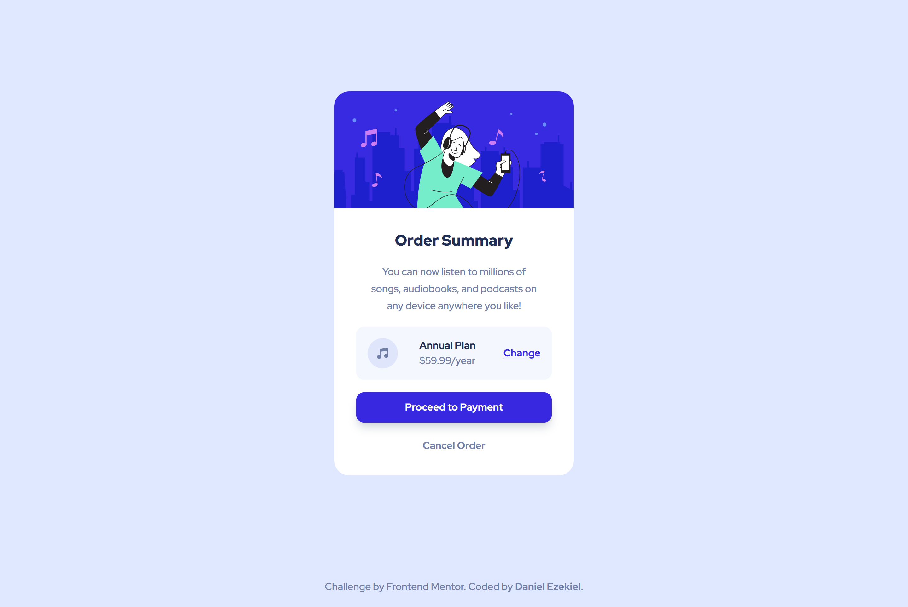

# Frontend Mentor - Order Summary component solution

This is a solution to the [Order Summary component challenge on Frontend Mentor](https://www.frontendmentor.io/challenges/order-summary-component-QlPmajDUj). Frontend Mentor challenges help you improve your coding skills by building realistic projects.

## Table of contents

- [Overview](#overview)
  - [The challenge](#the-challenge)
  - [Screenshot](#screenshot)
  - [Links](#links)
- [My process](#my-process)
  - [Built with](#built-with)
- [Author](#author)

## Overview

### The challenge

Users should be able to:

- View the optimal layout depending on their device's screen size
- See hover and focus states for interactive elements

### Screenshot

### Links

- Solution URL: https://github.com/Daniel-Ezekiel/Frontend-Mentor-Challenges/tree/main/Order%20Summary%20Component
- Live Site URL: https://product-carddd.vercel.app/

### Built with

- Semantic HTML5 markup
- CSS custom properties
- Flexbox
- Mobile-first workflow

## Author

- [Portfolio Website](https://www.danielezekiel.me)
- [LinkedIn](https://linkedin.com/in/db-ezekiel)
- Frontend Mentor - [@daniel-ezekiel](https://www.frontendmentor.io/profile/Daniel-Ezekiel)
- Twitter - [@dbezekiel](https://www.twitter.com/dbezekiel)
